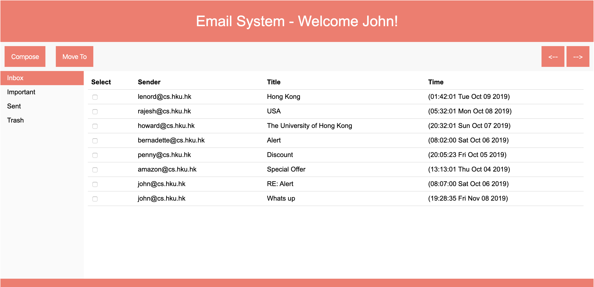
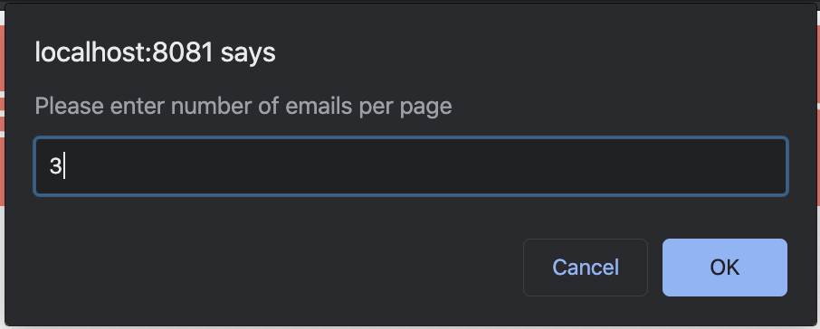

# Webmail-System

JS, HTML, CSS, NodeJS, ExpressJS, MongoDB

This application has the following features:
1. Open Emails
2. Compose Emails
3. Move Emails from Inbox-Important-Sent-Trash
4. Select number of emails on one page
5. Shift throw Emails using <-- -->

Run Database (MongoDB):

`cd iAlbums-MERN-Stack`

`mkdir data`

`./bin/mongod --dbpath YourPath/iAlbums-MERN-Stack/data`

`./bin/mongo`

Populate the database - 

`db.emailList.insert({'sender':'amy@cs.hku.hk', 'recipient':'john@cs.hku.hk', 'title':'Meeting today', 'time':'20:32:01 Fri Oct 11 2019', 'content':'Shall we meet at the library at 5pm?', 'mailbox':'Inbox'})`

Run Backend Server (Express):

`node app.js`

Open: `http://localhost:8081/webmail.html`